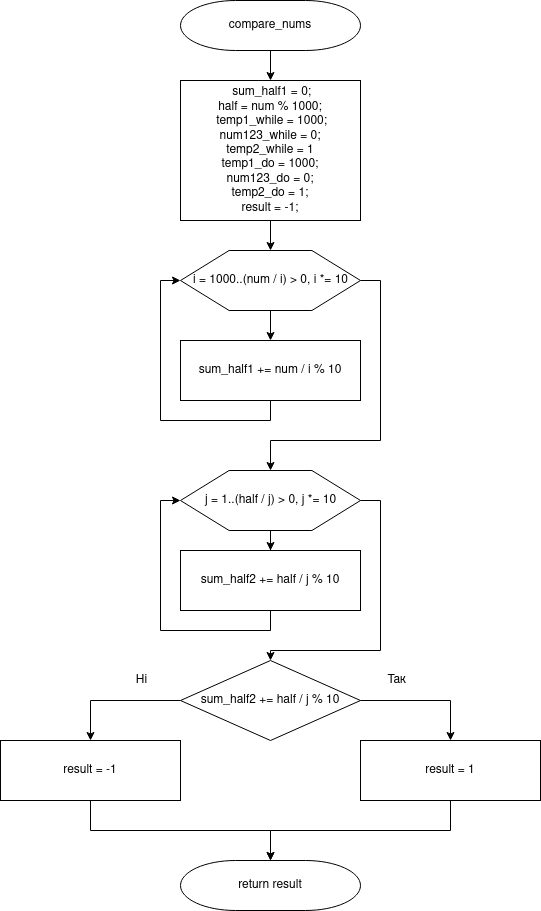
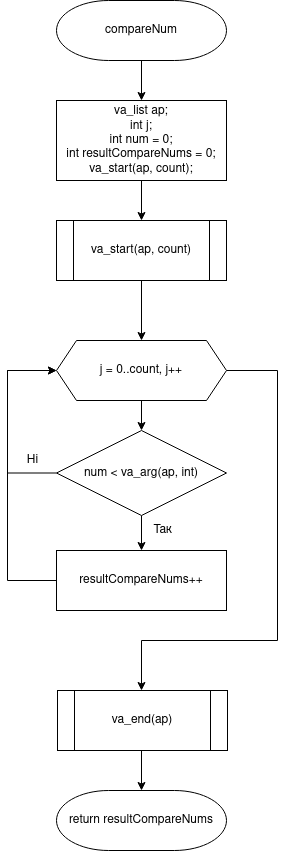
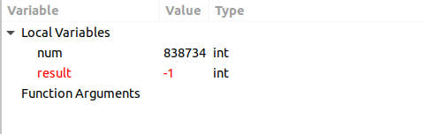

# Лабораторна робота №8. Вступ до блок-схем алгоритмів. №9. Вступ до документації коду (частина 1). №10. Вступ до локументації проекту.

## Вимоги:
* *Розробник*: Бельчинська Катерина
* *Загальне завдання*: Реалізувати програму з використанням функцій.
* *Індивідуальне завдання* : Реалізувати функцію, що визначає скільки серед заданої послідовності таких пар, у котрих перше число менше наступного, використовуючи функцію з варіативною кілткістю аргументів.
## Опис роботи
* *Функціональне призначення* :      Виконування дій програми за допомогою функцій, для спрощення загального завдання програми. Функція допомагає «розбити» велику задачу на підзадачі, у функції main лише зсилатися на їх опис.

* *Опис логічної структури для завдання 3 з лабораторної роботи № 5* :
	Функція 'main' генерує задане число та викликає функцію для обчислення результату. Схема алгоритму функції:
	
	
	
	Функція 'compare_nums' сумує перші та останні три цифри між собою відповідно та порівнює отримані значення між собою. Схема алгоритму функції:
	
	
	

* *Важливі елементи програми*:
   * Виділяємо та сумуємо між собою перші три цифри числа:
   ```
   int compare_nums(int num) {
	int sum_half1 = 0;
	for (int i = 1000; (num / i) > 0; i *= 10) {
		sum_half1 += num / i  % 10;
	}
   ```
   * Виділяємо та сумуємо між собою останні три цифри числа:
   ```
   int half = num % 1000;
	int sum_half2 = 0;
	for (int j = 1; (half / j) > 0; j *= 10) {
		sum_half2 += half / j % 10;
	}
   ```
   * Порівняння обох значень
   ```
   if (sum_half1 == sum_half2 && num123_while == num456_while && num123_do == num456_do) { 
 		result = 1; 
	} else {
		result = -1;
		
	}
   ```
  * *Опис логічної структури для завдання 3 з лабораторної роботи № 6* :
	Функція 'main' оприділяємо задане число, інціалізація результуючого масиву, виклик функції, яка заповнює цей масив, виклик варітивної функції, яка обчислює кількість пар, у яких перше число менше наступного.
	
	
	
	Функція 'copyOne' переписує число або розряд у результуючий масив. Схема алгоритму функції:
	
	
	
	Функція 'copyNum'оприділяє, яку цифру треба записати у результуючий масив. Схема алгоритму функції:
	
	
	
	Функція 'fillStr' заповнює результуючий масив, оприділяючи перед цим розряд заданого числа. Схема алгоритму функції:
	
	
	
	Функція 'compareNum' обчислює кількість пар, де перше число менше наступного. Схема алгоритму функції:
	
	
	
# Варіанти використання
* *Для завдання 3 з лабораторної роботи № 5*:
    У відладнику nemiver викликаємо у функції main три функції, які оприділяли «щасливе» задане число чи ні для циклів for, while do та do while.
    Викликаємо функцію для числа, обчисленого генератором псевдовипадкових чисел rand():
    
	число «не щасливе»:

	
	
	
	
	число «щасливе»:
    
	
	
* *Для завдання 3 з лабораторної роботи № 6*
    У відладнику nemiver за допомогою точок зупину заходимо у функцію, яка заповнює результуючий масив заданим числом, перетвореним у строкузадане число генерується за допомогою генератора псевдовипадкових чисел rand():
    
	.png)
	
	.png)
	
	.png)
	
* *Структура програми*:
```	
.
├── doc
│   ├── assets
│   │   ├── lab05_false2.png
│   │   ├── lab05_false.png
│   │   ├── lab05_task3_compare_nums.png
│   │   ├── lab05_task3_main.png
│   │   ├── lab05_true.png
│   │   ├── lab06(1).png
│   │   ├── lab06(2).png
│   │   ├── lab06(3).png
│   │   ├── lab06_task3_compareNum.png
│   │   ├── lab06_task3_copyNum.png
│   │   ├── lab06_task3_copyOne.png
│   │   ├── lab06_task3_fillStr.png
│   │   └── lab06_task3_main.png
│   ├── lab08_09_10.docx
│   ├── lab08_09_10.md
│   └── lab08_09_10.pdf
├── Doxyfile
├── lab05_task3
│   ├── README.md
│   └── src
│       └── main.c
├── lab06_task3
│   ├── README.md
│   └── src
│       └── main.c
├── Makefile
└── README.md

```
# Висновки
В ході даної лабораторної роботи, я навчилася використовувати функцкції, які повертають і не повертають результат, задля уникання повторів в коді; «спрощувати» загальне завдання,розбиваючи його на меньші 


