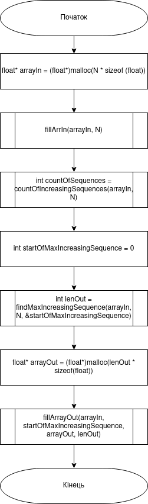
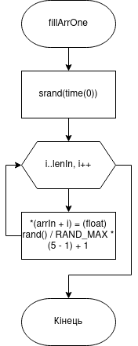
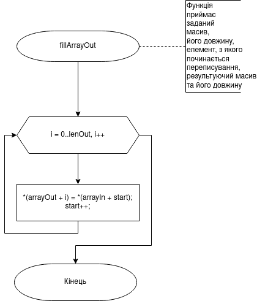

# Лабораторна робота №11. Вступ до показчиків

## Вимоги:
* *Розробник*: Бельчинська Катерина
* *Загальне завдання*: Реалізувати програму з використанням показчиків.
* *Індивідуальне завдання* : Дано масив з N речовинних чисел. Підрахувати кількість ділянок, які утворюють безперевні послідовності чисел з незменшуваними значеннями. Максимальну ділянку переписати у інший масив.
## Опис роботи
* *Функціональне призначення* : показчики доцільно використовувати для працювання не з копією елемнту, а безпосередньо з самим елементом, за допомогою його адреси знаходження у пам'яті
* *Опис логічної структури* :
	Функція 'main' виділяє пам'ть для заданого і результуючого масиву, викликає усі функції для заповнення заданного і результуючого масивів, визначення найбільшої незменшуваної послідовності. Схема алгоритму функції:
	
	
		
	Функція 'fillArrOne' заповнює заданий масив псевдовипадковими числами. Схема алгоритму функції:
	
	
		
	Функція 'countOfIncreasingSequences' рахує кількість незменшуваних послідовностей. Схема алгоритму функції:
		
	
		
	Функція 'findMaxIncreasingSequence' шукає найдовшу ділянку. Схема алгоритму функції:
	
	
		
	Функція 'fillArrayOut' заповнює результуючий масив. Схема алгоритму функції:
	
	
		
## Варіанти використання
