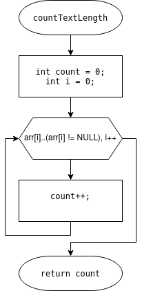
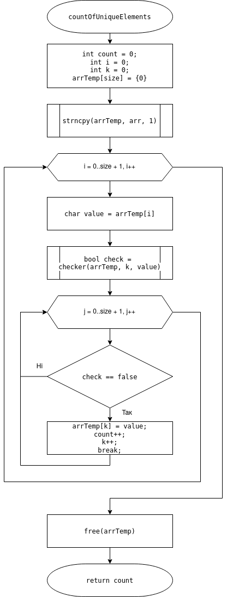
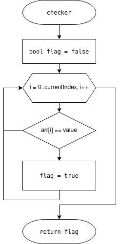
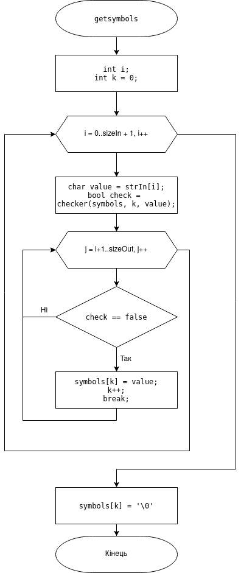
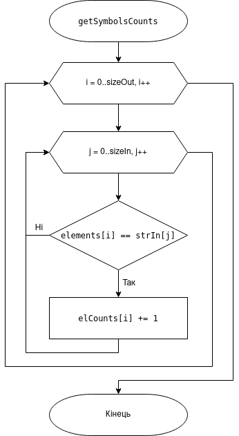

# ЛАБОРАТОРНА РОБОТА №13. СТРОКИ.

##1 ВИМОГИ

###1.1 Розробник
* Бельчинська Катерина Юріївна;
* студентка групи КІТ-320;
* 18 грудня 2020. 
  
###1.2. Індивідуальне 	завдання
Вирахувати для тексту частотну таблицю: для кожного символу визначити його частоту появи у тексті (число таких символів у тексті ділене на загальне число символів у тексті).

##2 ОПИС 	ПРОГРАМИ

###2.1. Функціональне призначення
Програму доцільно використовувати для розрахування частоти появи у даному тексті конкретного символу.

###2.2. Опис логічної структури
Функція 'main' виділяє пам'ять для заданого і результуючого масиву, викликає усі функції для обчислення частоти. Схема алгоритму функції наведена на рис. 1.

Функція countTextLength обчислює довжину заданого масиву. Схема алгоритму функції наведена на рис. 2.

Функція countOfUniqueElements  обчислює кількість унікальних елементів. Схема алгоритму функції наведена на рис. 3.

Функція checker перевіряє кожен елемент на повтори. Схема алгоритму функції наведена на рис. 4.

Функція getsymbols переписує унікальні елементи в масив. Схема алгоритму функції наведена на рис. 5.

Функція getSymbolsCounts отримує кількість повторів кожного елементу. Схема алгоритму функції наведена на рис. 6.

Функція fillZeros ініціолізує результуючий масив. Схема алгоритму функції наведена на рис. 7.

Функція getSymbolsFrequencies вираховує та записує в масив частоту появи кожного елементу. Схема алгоритму функції наведена на рис. 8.


Рис.1. Схема алгоритму функції main


Рис.2. Схема алгоритму функції CountTextLength.


Рис.3. Схема алгоритму функції CountOfUniqueElements.


Рис.4. Схема алгоритму функції checker.


Рис.5. Схема алгоритму функції getsymbols.


Рис.6. Схема алгоритму функції getSymbolsCounts.


Рис.7. Схема алгоритму функції fillZeros.


Рис.8. Схема алгоритму функції getSymbolsFrequencies.

###2.3 труктура проекту
````
.
├── doc
│   ├── assets
│   │   ├── checker.png
│   │   ├── countOfUniqueElements.png
│   │   ├── countTextLength.png
│   │   ├── debugger.png
│   │   ├── Doxygen1.png
│   │   ├── Doxygen2.png
│   │   ├── fillZeros.png
│   │   ├── getSymbolsCounts.png
│   │   ├── getSymbolsFrequencies.png
│   │   ├── getsymbols.png
│   │   ├── main.c.png
│   │   └── Valgrind.png
│   ├── lab13.docx
│   ├── lab13.md
│   └── lab13.pdf
├── Doxyfile
├── Makefile
├── README.md
├── task1
│   ├── README.md
│   └── src
│       ├── lib.c
│       ├── lib.h
│       └── main.c
├── task2
│   ├── README.md
│   └── src
│       ├── lib.c
│       ├── lib.h
│       └── main.c
├── task3
│   ├── README.md
│   └── src
│       ├── lib.c
│       ├── lib.h
│       └── main.c
└── task4
    ├── README.md
    └── src
        ├── lib.c
        ├── lib.h
        └── main.c

````
###2.4 Генерування Doxygen-документації


Рис. 9.  Титульна  сторінка Doxygen


Рис. 10. Структура файлів в Doxygen.

###2.5 Перевірка на утечки памʼяті за допомогою Valgrind:


Рис. 11 Перевірка на утечки памʼяті

##3 ВАРІАНТИ ВИКОРИСТАННЯ
Хід роботи та результат виконання програми доцільно спостерігати у відлагоднику. 


Рис. 12. Спостерігання за перебігом програми у відлагоднику.

##ВИСНОВКИ
В ході даної лабораторної роботи я навчилася проводити дії над строками за допомогою бібліотечних функцій.
