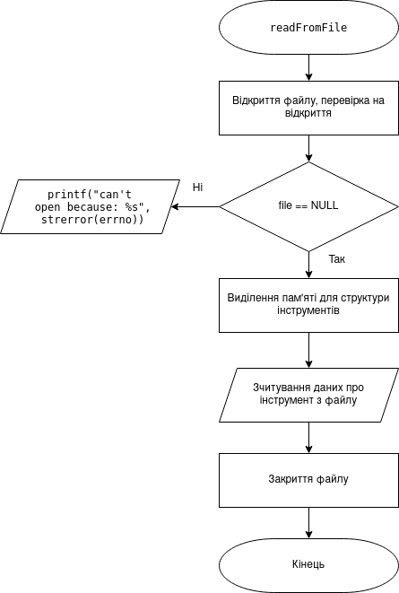
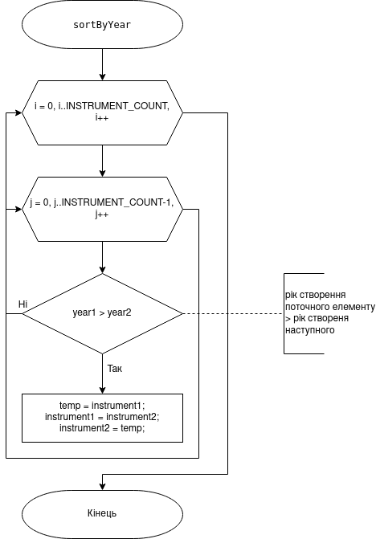
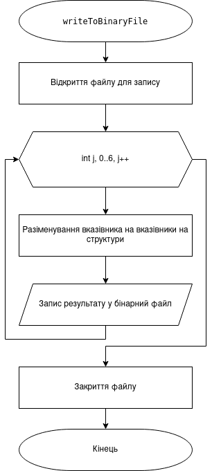
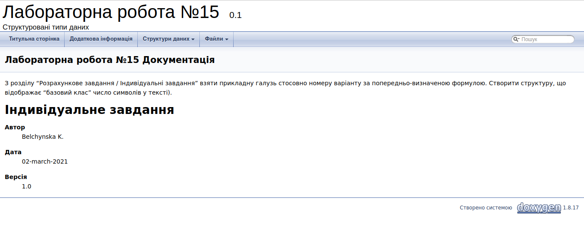
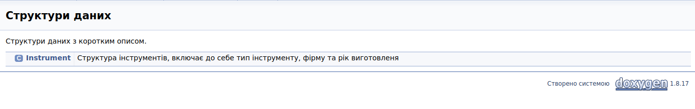

# ЛАБОРАТОРНА РОБОТА № 15. СТРУКТУРОВАНІ ТИПИ ДАНИХ.
# ЛАБОРАТОРНА РОБОТА № 17. МОДУЛЬНІ ТЕСТИ.

1 ВИМОГИ
#### Розробник 
* Бельчинська Катерина Юріївна;
* студентка групи КІТ-320;
* 24 лютого 2021 року. 
####Загальне завдання (лабораторна робота №15)
  З розділу “Розрахункове завдання / Індивідуальні завдання” взяти прикладну галузь стосовно номеру варіанту за попередньо-визначеною формулою. Створити структуру, що відображає “базовий клас”
#### Загальне завдання (лабораторна робота №17)
  Для попередньо розробленого функціоналу по роботі з прикладною областю, додати методи – модульні тести, що демонструють коректність роботи розробленого функціоналу. Розроблені методи мають перевірити коректність функціювання функцій на наборі заздалегідь визначених вхідних-вихідних даних. В ході роботи кожного тесту має виводитися інформація про ім’я функції-тесту, а також статус верифікації (пройшов / не пройшов). Якщо верифікація не пройшла, вивести на еркан, що саме не пройшло перевірку. В Makefile додати цілі для компіляції та запуску тестів (файл ./test/test.c). Для тестів рекомендовано використовувати бібліотеку cgreen.

2 ОПИС ПРОГРАМИ (ЛАБОРАТОРНА РОБОТА №15)
#### Функціональне призначення
* *Опис логічної структури* :
  Вивід на екран та у файл разультату роботи прграми:


Рисунок 1. Вхідні дані


Рисунок 2. Результуючий файл


Рисунок 3. Бінарний файл


#### Опис логічної структури


Рисунок 4. Функція main.c



Рисунок 5. Функція readFromFile



Рисунок 6. Функція sortByYear


Рисунок 7. Функція writeInFile



Рисунок 8. Функція writeToBinaryFile


Рисунок 9. Функція theOldestYamaha

#### Структура проекту

```.
├── doc
│   ├── assets
│   │   ├── doxygen_mainpage.png
│   │   ├── doxygen_structs.png
│   │   ├── main.c.png
│   │   ├── printTheOldestInstrument.png
│   │   ├── readFromFile.png
│   │   ├── sortByYear.png
│   │   ├── textIn.png
│   │   ├── textOut.bin.png
│   │   ├── textOut.png
│   │   ├── theOldestYamaha.png
│   │   ├── valgrind.png
│   │   ├── writeInFile.png
│   │   └── writeToBinaryFile.png
│   └── lab15.md
├── Doxyfile
├── Makefile
└── task1
└── src
├── lib.c
├── lib.h
└── main.c

```
#### Генерування Doxygen-документації



Рисунок 10. Головна сторінка doxygen



Рисунок 11. Структура в документації
#### Перевірка на утечки памʼяті за допомогою Valgrind:


Рисунок 12.

3 ОПИС ПРОГРАМИ (ЛАБОРАТОРНА РОБОТА №17)
#### Функціональне призначення
#### Опис логічної структури
#### Структура проекту
#### Генерування Doxygen-документації
#### Перевірка на утечки памʼяті за допомогою Valgrind:

4 ВАРІАНТИ ВИКОРИСТАННЯ (ЛАБОРАТОРНА РОБОТА №15)
Вивід результату у консоль і у файл
5 ВАРІАНТИ ВИКОРИСТАННЯ (ЛАБОРАТОРНА РОБОТА №17)
ВИСНОВКИ
В ході даних лабораторних робіт була досліджена робота зі структурами та створені тести на розроблені програми
