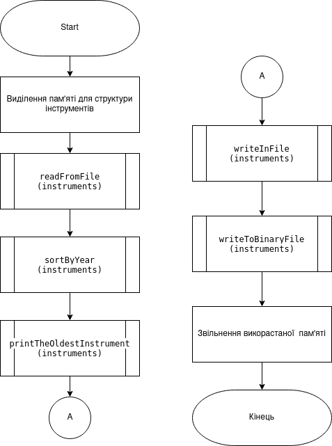
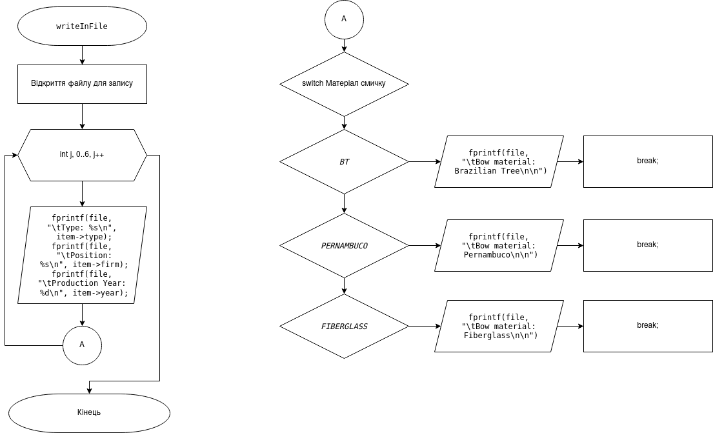
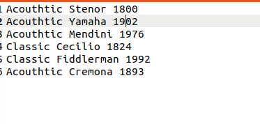
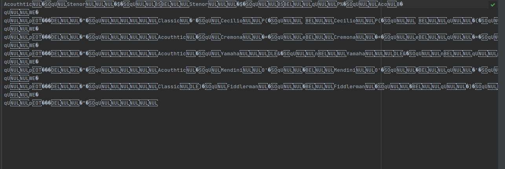
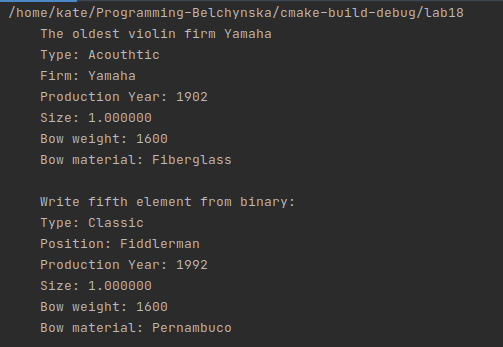
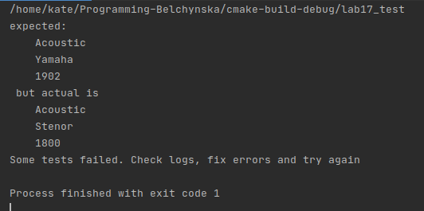
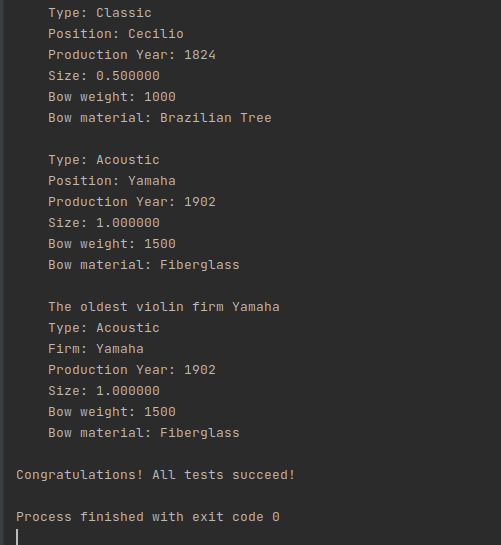

# ЛАБОРАТОРНА РОБОТА № 15. СТРУКТУРОВАНІ ТИПИ ДАНИХ.
# ЛАБОРАТОРНА РОБОТА № 17. МОДУЛЬНІ ТЕСТИ.

1 ВИМОГИ
#### Розробник 
* Бельчинська Катерина Юріївна;
* студентка групи КІТ-320;
* 15 березня 2021 року. 
####Загальне завдання (лабораторна робота №15)
  З розділу “Розрахункове завдання / Індивідуальні завдання” взяти прикладну галузь стосовно номеру варіанту за попередньо-визначеною формулою. Створити структуру, що відображає “базовий клас”
#### Загальне завдання (лабораторна робота №17)
  Для попередньо розробленого функціоналу по роботі з прикладною областю, додати методи – модульні тести, що демонструють коректність роботи розробленого функціоналу. Розроблені методи мають перевірити коректність функціювання функцій на наборі заздалегідь визначених вхідних-вихідних даних. В ході роботи кожного тесту має виводитися інформація про ім’я функції-тесту, а також статус верифікації (пройшов / не пройшов). Якщо верифікація не пройшла, вивести на еркан, що саме не пройшло перевірку. В Makefile додати цілі для компіляції та запуску тестів (файл ./test/test.c). Для тестів рекомендовано використовувати бібліотеку cgreen.

2 ОПИС ПРОГРАМИ (ЛАБОРАТОРНА РОБОТА №15)
#### Функціональне призначення
* *Опис логічної структури* :





Рисунок 1. Функція main.c


Рисунок 2. Функція readFromFile


Рисунок 3. Функція sortByYear



Рисунок 4. Функція writeInFile


Рисунок 5. Функція writeToBinaryFile


Рисунок 6. Функція theOldestYamaha

#### Структура проекту

```.
├── doc
│   ├── assets
│   │   ├── doxygen_mainpage.png
│   │   ├── doxygen_structs.png
│   │   ├── main.c.png
│   │   ├── printTheOldestInstrument.png
│   │   ├── readFromFile.png
│   │   ├── sortByYear.png
│   │   ├── textIn.png
│   │   ├── textOut.bin.png
│   │   ├── textOut.png
│   │   ├── theOldestYamaha.png
│   │   ├── valgrind.png
│   │   ├── writeInFile.png
│   │   └── writeToBinaryFile.png
│   └── lab15.md
├── Doxyfile
├── Makefile
└── task1
└── src
├── lib.c
├── lib.h
└── main.c

```
#### Генерування Doxygen-документації


Рисунок 7. Головна сторінка doxygen


Рисунок 8. Структура в документації
#### Перевірка на утечки памʼяті за допомогою Valgrind:


Рисунок 9.

3 ОПИС ПРОГРАМИ (ЛАБОРАТОРНА РОБОТА №17)
#### Функціональне призначення
Покриття розробленного попередньо програмного забезпечення модульними тестами для перевірки отриманих результатів.

#### Структура проекту
````
.
├── dist
│   ├── main.bin
│   └── test.bin
├── doc
├── Makefile
├── README.md
├── src
│   ├── lib.c
│   ├── lib.h
│   └── main.c
└── test
└── test.c
````


4 ВАРІАНТИ ВИКОРИСТАННЯ (ЛАБОРАТОРНА РОБОТА №15)
Вивід на екран та у файл разультату роботи прграми:



Рисунок 10. Вхідні дані


Рисунок 11. Результуючий файл



Рисунок 12. Бінарний файл



Рисунок 13. Вивід результату у консоль і у файл

5 ВАРІАНТИ ВИКОРИСТАННЯ (ЛАБОРАТОРНА РОБОТА №17)

Перевірка розробленого функціоналу за допомогою модульних тестів.



Рисунок 13. Падіння тестів через помилку



Рисунок 14. Успішне виконання тесту.

ВИСНОВКИ
В ході даних лабораторних робіт була досліджена робота зі структурами та створені тести на розроблені програми
