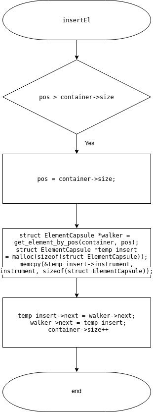
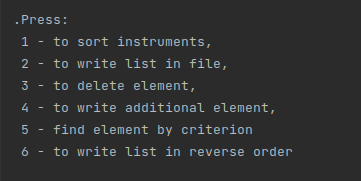

# ЛАБОРАТОРНА РОБОТА № 18. ДИНАМІЧНІ МАСИВИ.
# ЛАБОРАТОРНА РОБОТА № 19. ДИНАМІЧНІ СПИСКИ.
1. ВИМОГИ
#### 1.1. Розробник
* Бельчинська Катерина Юріївна;
* студентка групи КІТ-320;
* 2021
#### 1.2. Загальне завдання (лабораторна робота №18)
* розробити функцію, яка реалізує вставку в рядок “s” другий рядок “s2” в “i”-у позицію рядка “s”;
* розробити функцію видалення з рядка “s” усіх символів з індексами в заданому діапазоні;
* за допомогою функцій memcpy, memset створити функції додання та видалення елементів з динамічного масиву вашої прикладної області;
* додати модульні тести, що демонструють коректність розроблених функцій.
#### 1.3. Загальне завдання (лабораторна робота №19)
* реалізувати сортування вмісту списку за одним з критеріїв. При цьому обов’язково забеспечити, щоб обмін місцями об’єктів здійснювався шляхом обміну їх покажчиків.
2. ОПИС ПРОГРАМИ (ЛАБОРАТОРНА РОБОТА №18)
#### 2.1. Функціональне призначення
Використання динамічних масивів для динамічного виділення пам'яті та використання функцій memcopy та memset.


#### 2.2. Опис логічної структури


Рисунок 1. Функція видалення частини строки.


Рисунок 2. Функція для вставки однієї строки в іншу.


Рисунок 3. Функція для видалення елементу з масиву елементів.


Рисунок 4. Функція для додавання елементу у масив елементів.

#### 2.3. Структура проекту
````
.
├── doc
│   ├── assets
│   │   ├── addElement.png
│   │   ├── cleanUp.png
│   │   ├── copyStructElement.png
│   │   ├── delete_array.png
│   │   ├── deleteElementNext.png
│   │   ├── deleteStructElement.png
│   │   ├── dialog.png
│   │   ├── findByCriterion.png
│   │   ├── get_element_by_pos.png
│   │   ├── getInstrumentList.png
│   │   ├── insertEl.png
│   │   ├── insert.png
│   │   ├── showArray.png
│   │   ├── sortByYearList.png
│   │   └── writeInFileList.png
│   └── lab18_lab19.md
├── Doxyfile
├── Makefile
├── README.md
├── src
│   ├── CMakeLists.txt
│   ├── lib.c
│   ├── lib.h
│   └── main.c
└── test
    └── test.c
````
#### 2.4. Генерування Doxygen-документації


Рисунок 5.

#### 2.5. Перевірка на утечки памʼяті за допомогою Valgrind:


Рисунок. 6.

3. ОПИС ПРОГРАМИ (ЛАБОРАТОРНА РОБОТА №19)

#### 3.1. Функціональне призначення
Використання двонаправлених списків для пересування між елементами масиву елементів в обидві сторони


#### 3.2. Опис логічної структури


Рисунок 7. Перехід до потрібного елементу за заданою позицією.



Рисунок 8. Додавання пам'яті для нового елементу.


Рисунок 9. Читання списку інструментів з файлу.


Рисунок 10. Сортування списку за роком виготовлення.


Рисунок 11. Запис списку у файл.


Рисунок 12. Додавання елементу до списку.


Рисунок 13. Видалення елементу зі списку.


Рисунок 14. Вивід вмісту списку на екран.


Рисунок 15. Пошук елементу зі списку за фірмою Yamaha.


Рисунок 16. Діалог з користувачем для виконання певних дій.


Рисунок 17. Звільнення пам'яті для списку.

#### 3.3. Структура проекту
````
.
├── doc
│   ├── assets
│   │   ├── addElement.png
│   │   ├── add_struct_element.png
│   │   ├── cleanUp.png
│   │   ├── copyStructElement.png
│   │   ├── delete_array.png
│   │   ├── deleteElementNext.png
│   │   ├── deleteStructElement.png
│   │   ├── delete_struct_element.png
│   │   ├── dialog.png
│   │   ├── doxygen.png
│   │   ├── findByCriterion.png
│   │   ├── get_element_by_pos.png
│   │   ├── getInstrumentList.png
│   │   ├── insertEl.png
│   │   ├── insert.png
│   │   ├── showArray.png
│   │   ├── sortByYearList.png
│   │   ├── tests_lab18.png
│   │   └── writeInFileList.png
│   └── lab18_lab19.md
├── Doxyfile
├── src
│   ├── data.c
│   ├── data.h
│   ├── list.c
│   ├── list.h
│   └── main.c
└── test
    └── test.c
````
4. ВАРІАНТИ ВИКОРИСТАННЯ (ЛАБОРАТОРНА РОБОТА №18)


Рисунок 18. Результат видалення елементу з масиву елементів.


Рисунок 19. Результат додавання елементу з масиву елементів.


Рисунок 20. Тести для додавання строки у іншу строку та видалення частини строки.


5. ВАРІАНТИ ВИКОРИСТАННЯ (ЛАБОРАТОРНА РОБОТА №19)



Рисунок 21. Діалог з користувачем.


Рисунок 22. Сортований список за роком виготовлення інструментів.


Рисунок 23. Запис  списку у файл.


Риунок 24. Видалення елементу зі списку.


Рисунок 25. Додавання елементу у список.


Рисунок 26. Пошук скрипки фірми Yamaha.


Рисунок 27. Написання списку у зворотньому порядку.


ВИСНОВКИ

В ході виконання даних лабораторних робіт була осовоєна з динамічними масивами та списками.
