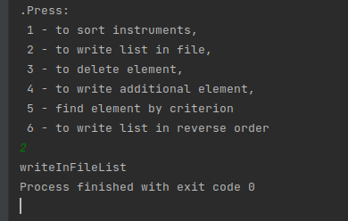
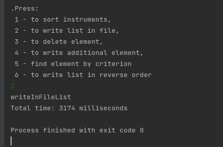
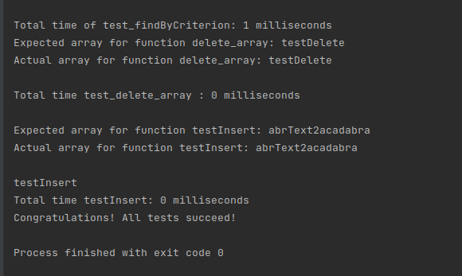
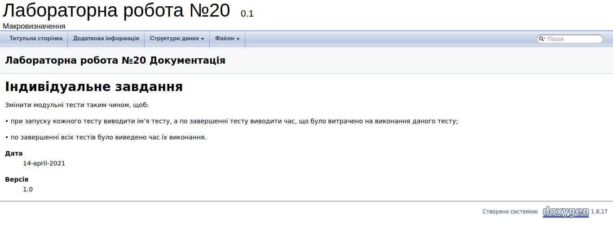

# ЛАБОРАТОРНА РОБОТА № 20. МАКРОВИЗНАЧЕННЯ.

1. ВИМОГИ
#### 1.1. Розробник
* Бельчинська Катерина Юріївна;
* студентка групи КІТ-320;
* 14 квітня 2021

#### 1.2. Загальне завдання

Змінити модульні тести таким чином, щоб:

• при запуску кожного тесту виводити ім’я тесту, а по завершенні тесту виводити час, що було витрачено на виконання даного тесту;

• по завершенні всіх тестів було виведено час їх виконання.

2. ОПИС ПРОГРАМИ 
#### 2.1. Функціональне призначення



Рисунок 1. При виклику функції вивід назви цієї функції на екран



Рисунок 2. При виклику функції вивід часу, який витратила програма на виконання.



Рисунок 3. При роботі тестів виводиться назва кожного тесту, час його виконання та час виконання усіх тестів разом.

#### 2.2. Структура проекту
````
.
├── doc
│   ├── assets
│   │   ├── print_name_of_function.png
│   │   ├── test_time_of_work.png
│   │   └── time_of_programm_working.png
│   └── lab20.md
├── Doxyfile
├── Makefile
├── src
│   ├── data.c
│   ├── data.h
│   ├── list.c
│   ├── list.h
│   └── main.c
└── test
└── test.c
````
#### 2.3. Генерування Doxygen-документації



Рисунок 4. Генерування Doxygen-документації.

3. ВАРІАНТИ ВИКОРИСТАННЯ

Прогаму доцільно використовувати для визначення часу роботи функції і виведення назви безпосередньо виконуваної функції.
Використання макровизначень можливо для виклику функції при команді DEBUG:
````
#ifdef DEBUG
    long  start = currentTimeMillis();
#endif
````

ВИСНОВКИ

В ході виконання даної лабораторної роботи були освоєні макровизначення та методи роботи з ним.