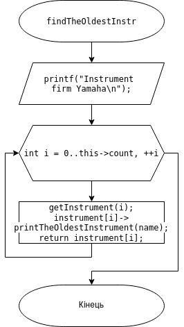
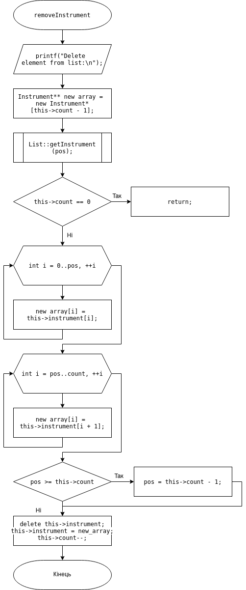

# ЛАБОРАТОРНА РОБОТА № 23. ООП. ВСТУП ДО ООП.
1. ВИМОГИ
#### 1.1. Розробник
* Бельчинська Катерина Юріївна;
* студентка групи КІТ-320;
* 8 травня 2021.
#### 1.2. Загальне завдання
Для предметної галузі з розділу “Розрахункове завдання / Індивідуальне завдання” розробити два класи:

- клас, що зображує сутність “базового класу”, у тому числі:

- конструктор за замовчуванням, копіювання та конструктор з аргументами (реалізація конструкторів повинна бути продемонстрована за допомогою списків інціалізацій);

- деструктор; 

- клас, що має у собі динамічний масив об’єктів базового класу та має в собі методи додавання, видалення елемента, отримання елемента по індексу (або ідентифікатору), вивід усіх елементів на екран.

2. ОПИС ПРОГРАМИ
#### 2.1. Функціональне призначення


Рисунок 1. Додавання інструменту у список.


Рисунок 2. Видалення інструменту зі списку.


Рисунок 3. Знаходження у списку інструменту фірми Yamaha

#### 2.2. Опис логічної структури


Рисунок 4. Блок-схема алгоритму методу для функції main

.png)

Рисунок 5. Блок-схема алгоритму методу для виводу на екран інформації про смичок

.png)

Рисунок 6. Блок-схема алгоритму методу для виводу на екран інформації про інструмент



Рисунок 7. Блок-схема алгоритму методу для виводу на екран інформації про найстарший інструмент


Рисунок 8. Блок-схема алгоритму методу для додавання інструменту у список



Рисунок 9. Блок-схема алгоритму методу для видалення інструменту зі списку


Рисунок 10. Блок-схема алгоритму методу для виводу списку інструментів на екран

.png)

Рисунок 11. Блок-схема алгоритму методу для отримання вказівника на інструмент за його позицією


Рисунок 12. Блок-схема алгоритму методу для виводу на екран найстаршого інструменту

#### 2.3. Структура проекту

```
.
├── doc
│   ├── assets
│   │   ├── add_elment.png
│   │   ├── addInstrument(.png
│   │   ├── delete_element.png
│   │   ├── Doxygen.png
│   │   ├── findTheOldestInstr.png
│   │   ├── instr_firm_yamaha.png
│   │   ├── Instrument:: printTheOldestInstrument.png
│   │   ├── List:: getInstrument(size_t index).png
│   │   ├── main.png
│   │   ├── removeInstrument.png
│   │   ├── showInstrument.png
│   │   ├── void Bow::print().png
│   │   └── void Instrument::print().png
│   └── lab23.md
├── Doxyfile
├── Makefile
├── README.md
├── src
│   ├── data.cpp
│   ├── data.h
│   ├── list.cpp
│   ├── list.h
│   └── main.cpp
└── test
    └── test.cpp
```

#### 2.4. Генерування Doxygen-документації


Рисунок 13. Генерація Doxygen документації

3. ВАРІАНТИ ВИКОРИСТАННЯ

Програму доцільно використовувати для проведення примітивних операцій над списком класів-об'єктів. Освоєння такого типу даних як клас.

ВИСНОВКИ

В ході виконання даної роботи були освоєні методи роботи з класом, створено конструктори та деструктори та клас, що має динамічний масив інструментів, створено публічні методи роботи з ними.
