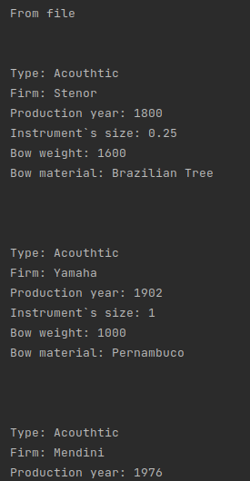
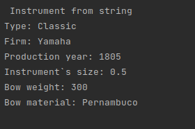
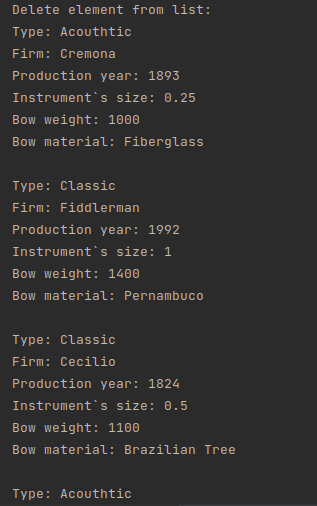
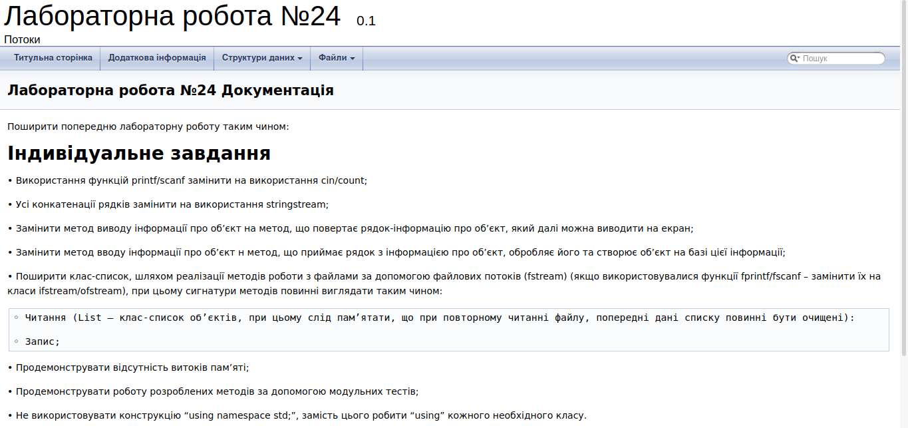

# ЛАБОРАТОРНА РОБОТА № 24. ООП. ПОТОКИ.
1. ВИМОГИ
#### 1.1. Розробник
* Бельчинська Катерина Юріївна;
* студентка групи КІТ-320;
* 28 травня 2021.
#### 1.2. Загальне завдання
Поширити попередню лабораторну роботу таким чином:
• Використання функцій printf/scanf замінити на використання cin/count;
• Усі конкатенації рядків замінити на використання stringstream;
• Замінити метод виводу інформації про об’єкт на метод, що повертає рядок-інформацію про об’єкт, який далі можна виводити на екран;
• Замінити метод вводу інформації про об’єкт н метод, що приймає рядок з інформацією про об’єкт, обробляє його та створює об’єкт на базі цієї інформації;
• Поширити клас-список, шляхом реалізації методів роботи з файлами за допомогою файлових потоків (fstream) (якщо використовувалися функції fprintf/fscanf – замінити їх на класи ifstream/ofstream), при цьому сигнатури методів повинні виглядати таким чином:
◦ Читання (List – клас-список об’єктів, при цьому слід пам’ятати, що при повторному читанні файлу, попередні дані списку повинні бути очищені):
◦ Запис;
• Продемонструвати відсутність витоків пам’яті;
• Продемонструвати роботу розроблених методів за допомогою модульних тестів;
• Не використовувати конструкцію “using namespace std;”, замість цього робити “using” кожного необхідного класу.
2. ОПИС ПРОГРАМИ
#### 2.1. Функціональне призначення



Рисунок 1. Читання списку з файлу.



Рисунок 2. Створення елементу зі строки.



Рисунок 3. Видалення елементу зі списку.

#### 2.2. Опис логічної структури


Рисунок 4. Блок-схема алгоритму методу для функції main

.png)

Рисунок 5. Блок-схема алгоритму методу для виводу на екран інформації про смичок

.png)

Рисунок 6. Блок-схема алгоритму методу для виводу на екран інформації про інструмент


Рисунок 7. Блок-схема алгоритму методу для виводу на екран інформації про найстарший інструмент


Рисунок 8. Блок-схема алгоритму методу для додавання інструменту у список


Рисунок 9. Блок-схема алгоритму методу для видалення інструменту зі списку


Рисунок 10. Блок-схема алгоритму методу для виводу списку інструментів на екран

.png)

Рисунок 11. Блок-схема алгоритму методу для отримання вказівника на інструмент за його позицією


Рисунок 12. Блок-схема алгоритму методу для виводу на екран найстаршого інструменту

#### 2.3. Структура проекту

```
.
├── doc
│   ├── assets
│   │   ├── doxygen.png
│   │   ├── element_from_string.png
│   │   ├── read_from_file.png
│   │   └── remove.png
│   └── lab24.md
├── Doxyfile
├── instrumentsOut.txt
├── instruments.txt
├── Makefile
├── README.md
├── src
│   ├── data.cpp
│   ├── data.h
│   ├── list.cpp
│   ├── list.h
│   └── main.cpp
└── test
    └── test.cpp

```

#### 2.4. Генерування Doxygen-документації



Рисунок 13. Генерація Doxygen документації

3. ВАРІАНТИ ВИКОРИСТАННЯ

Програму доцільно використовувати для проведення примітивних операцій над списком класів-об'єктів. Освоєння такого типу даних як клас.

ВИСНОВКИ

В ході виконання даної роботи були освоєні методи роботи з класом, створено конструктори та деструктори та клас, що має динамічний масив інструментів, створено публічні методи роботи з ними.
