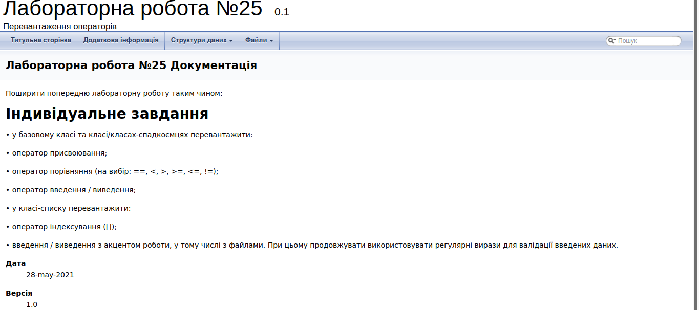

# ЛАБОРАТОРНА РОБОТА № 23. ООП. ВСТУП ДО ООП.
1. ВИМОГИ
#### 1.1. Розробник
* Бельчинська Катерина Юріївна;
* студентка групи КІТ-320;
* 28 травня 2021.
#### 1.2. Загальне завдання

Поширити попередню лабораторну роботу таким чином:

• у базовому класі та класі/класах-спадкоємцях перевантажити:

• оператор присвоювання;

• оператор порівняння (на вибір: ==, <, >, >=, <=, !=);

• оператор введення / виведення;

• у класі-списку перевантажити:

• оператор індексування ([]);

• введення / виведення з акцентом роботи, у тому числі з файлами. При цьому продовжувати використовувати регулярні вирази для валідації введених даних.

2. ОПИС ПРОГРАМИ

#### 2.1. Функціональне призначення

Перевантаження запобігає логічному дублюванню коду та спрощує певну кількість операцій

#### 2.2. Особливості програми

У коді реалізації присутні методи для перевантаження таких операторів:

- оператор присвоювання:

``` 
    List& operator = (const List& other) {
        if (this == &other) { // 0) проверка на самоприсваивание
            return *this;
        }
        delete [] instrument;	                   

        count = other.count;

        instrument = new Instrument *[count];
        for (int i = 0; i < count; ++i) {
            instrument[i] = new Instrument[count];
        } // 2) create new data


        for (int i = 0; i < count; i++) { // 3) fill data

            instrument[i] = other.instrument[i];

        }

        return *this;
    }
```

- оператор порівняння:

```
    bool operator == (const Instrument& other) const {
        return this->firm == other.firm && this->type == other.type && this->size == other.size && this->bow.getWeight() == other.bow.getWeight();

    }
```

- оператор виводу на екран або у файл:

```
 for (int i = 0; i < this->count; ++i) {
        std::cout << *instrument[i];
    }
```
- оператор вводу:

```
    input >> instrument.type;
    input >> instrument.firm;
    input >> instrument.year;
    input >> instrument.size;
```
- оператор індексування:
```
    Instrument& operator[](size_t i) const {

        if (i < count)  {  //throw std::exception(“index out of range”)
            return *instrument[i];
        }
    }
```

#### 2.3. Структура проекту

```
.
├── doc
│   └── lab25.md
├── Doxyfile
├── Makefile
├── README.md
├── src
│   ├── data.cpp
│   ├── data.h
│   ├── list.cpp
│   ├── list.h
│   └── main.cpp
└── test
    └── test.cpp
```

#### 2.4. Генерування Doxygen-документації



ВИСНОВКИ

В ході виконання даної роботи були перевантажені оператори індексування, вводу виводу, присвоювання та порівняння.


