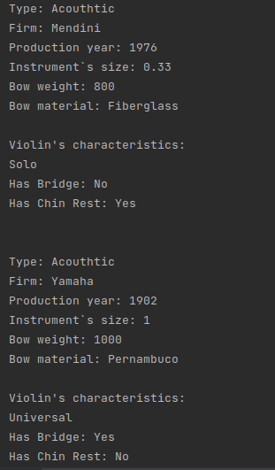
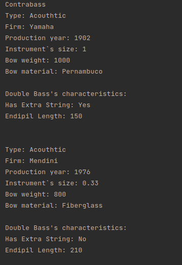
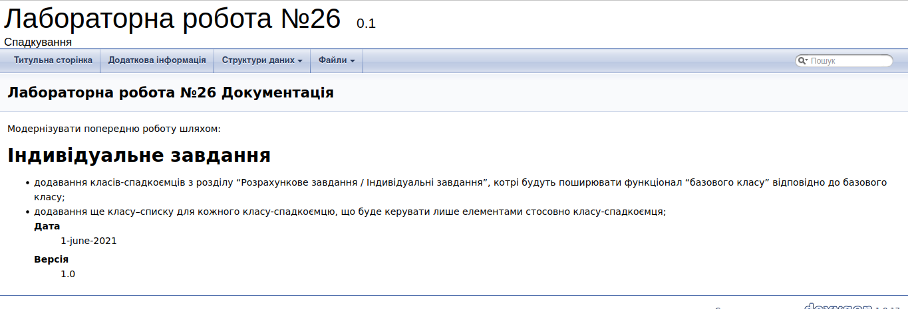

# ЛАБОРАТОРНА РОБОТА № 25. ПЕРЕВАНТАЖЕННЯ ОПЕРАТОРІВ.
1. ВИМОГИ
#### 1.1. Розробник
* Бельчинська Катерина Юріївна;
* студентка групи КІТ-320;
* 1 червня 2021.
#### 1.2. Загальне завдання

Модернізувати попередню роботу шляхом:

• додавання класів-спадкоємців з розділу “Розрахункове завдання / Індивідуальні завдання”,
котрі будуть поширювати функціонал “базового класу” відповідно до базового класу;

• додавання ще класу–списку для кожного класу-спадкоємцю, 
що буде керувати лише елементами стосовно класу-спадкоємця;
2. ОПИС ПРОГРАМИ

#### 2.1. Функціональне призначення



Рисунок 1. Список скрипок.




Рисунок 2. Список контрабасів.

#### 2.2. Особливості програми
В методах спадкоємців присутні деякі методи, які є перевантаженими від базового класу. Наприклад

```
string getInfo() const override;
```

Класи спадкоємці викликають функцію базового класу та додають власну інформацію:

```
ss << Instrument::getInfo();
        ss << "Violin's characteristics: " << std::endl;
        switch (this->violinType) {
            case SOLO: ss << "Solo" << endl;
                break;
            case ORCHESTRAL: ss << "Orchestral" << endl;
                break;
            case UNIVERSAL: ss << "Universal" << endl;
        }
```


#### 2.3. Структура проекту

```
.
├── doc
│   ├── assets
│   │   ├── ContrabassListAdd.png
│   │   ├── cout.png
│   │   ├── element _from_string.png
│   │   ├── endpil_list.png
│   │   ├── test.png
│   │   ├── violinList.png
│   │   ├── violin_list.png
│   │   └── write_list_in_file.png
│   └── lab26.md
├── Doxyfile
├── Makefile
├── README.md
├── src
│   ├── data.cpp
│   ├── data.h
│   ├── list.cpp
│   ├── list.h
│   └── main.cpp
└── test
    └── test.cpp

```

#### 2.4. Генерування Doxygen-документації



Рисунок 3. Генерування Doxygen-документації

ВИСНОВКИ

В ході виконання даної роботи були первантажені методи базового класу для класів-спадкоємців та створені списки для спадкоємців.


