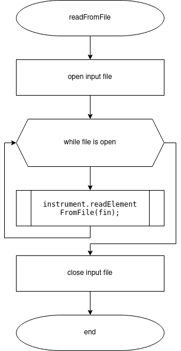
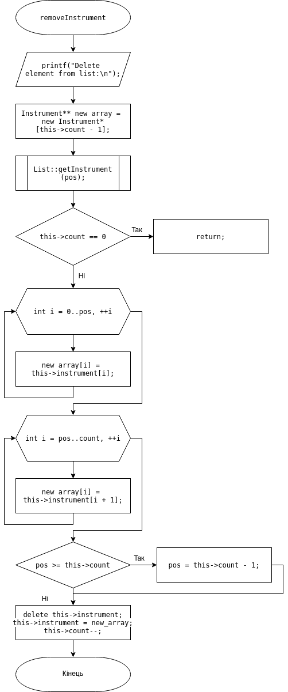
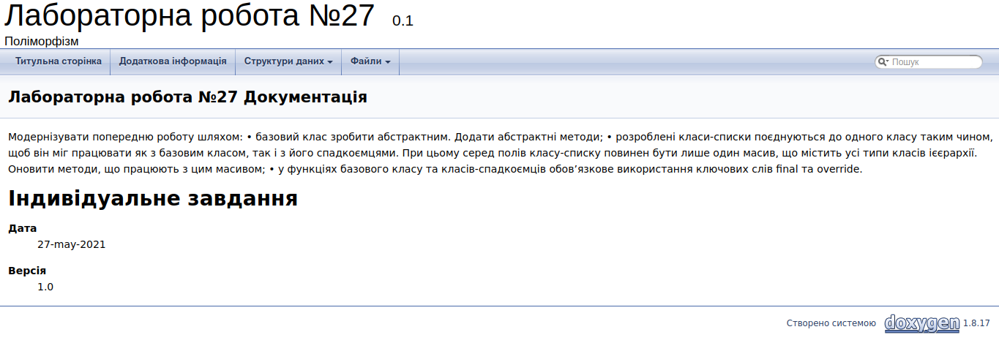

# ЛАБОРАТОРНА РОБОТА № 25. ПЕРЕВАНТАЖЕННЯ ОПЕРАТОРІВ.
1. ВИМОГИ
#### 1.1. Розробник
* Бельчинська Катерина Юріївна;
* студентка групи КІТ-320;
* 1 червня 2021.
#### 1.2. Загальне завдання

Модернізувати попередню роботу шляхом:

• базовий клас зробити абстрактним. Додати абстрактні методи;

• розроблені класи-списки поєднуються до одного класу таким чином, 
щоб він міг працювати як з базовим класом, так і з його спадкоємцями. При цьому серед полів класу-списку повинен бути лише один масив, що містить усі типи класів ієєрархії. Оновити методи, що працюють з цим масивом;

• у функціях базового класу та класів-спадкоємців обов’язкове використання ключових слів final та override.

#### 2.1. Функціональне призначення

Програмне забезпечення демонструє використання поліморфізму в ООП. Базовий клас - абстрактний, абстрактні методи мають реалізацію у класах спадкоємцях.


#### 2.2. Особливості програми
Методи роботи зі списком перероблені за ідеями поліморфізму:


```
void List::addInstrument(Instrument * instrument1, int pos) {

    Instrument** new_arr = new Instrument*[this->count + 1];
    new_arr[0] = instrument1;
    for (int i = 0; i < count ; ++i) {
        instrument[i] = &getInstrument(i);
        new_arr[i + 1] = instrument[i];
    }

    delete this->instrument;
    this->instrument = new_arr;
    this->count++;

}
```

 Методи не можуть працювати безпосередньо з абстрактним базовим класом, тому працюють з вказівником, для якого присвоюється значення у функції main, наприклад:

```
list->readFromFile(violinFileName, new Violin());
```
#### 2.3. Опис логічної структури



Рисунок 1. Блок-схема алгоритму методу читання списку з файлу


Рисунок 2. Блок-схема алгоритму методу додавання елементу



Рисунок 3. Блок-схема алгоритму методу видалення елементу зі списку

#### 2.4. Структура проекту

```
.
├── doc
│   ├── assets
│   │   ├── ContrabassListAdd.png
│   │   ├── cout.png
│   │   ├── element _from_string.png
│   │   ├── endpil_list.png
│   │   ├── test.png
│   │   ├── violinList.png
│   │   ├── violin_list.png
│   │   └── write_list_in_file.png
│   └── lab26.md
├── Doxyfile
├── Makefile
├── README.md
├── src
│   ├── data.cpp
│   ├── data.h
│   ├── list.cpp
│   ├── list.h
│   └── main.cpp
└── test
    └── test.cpp

```

#### 2.5. Генерування Doxygen-документації



Рисунок 4. Генерування Doxygen-документації

ВИСНОВКИ

В ході виконання даної роботи були об'єднані списки для роботи з колекцією та використані ідеї поліморфізму


