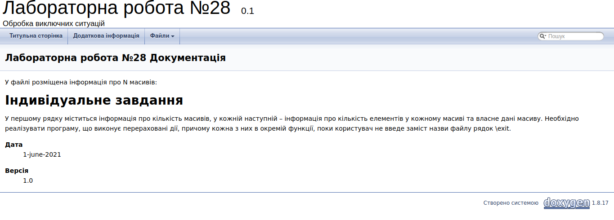

# ЛАБОРАТОРНА РОБОТА № 28. ООП. ОБРОБКА ВИКЛЮЧНИХ СИТУАЦІЙ.
1. ВИМОГИ
#### 1.1. Розробник
* Бельчинська Катерина Юріївна;
* студентка групи КІТ-320;
* 28 травня 2021.
#### 1.2. Загальне завдання

У файлі розміщена інформація про N масивів.

У першому рядку міститься інформація про кількість масивів, у
кожній наступній – інформація про кількість елементів у кожному масиві та власне дані масиву.
Необхідно реалізувати програму, що виконує перераховані дії, причому кожна з них в окремій 
функції, поки користувач не введе заміст назви файлу рядок \exit.
2. ОПИС ПРОГРАМИ

#### 2.1. Функціональне призначення

Програму доцільно використовувати для обробки виключних ситуацій та характеристики аварійного завершення програми у випадках,
 які не залежатимуть від розробника.


#### 2.2. Особливості програми

Завдяки конструкції throw/catch try/catch відстежуються виключні ситуації, наприклад:

```
try {
        if (!fin.is_open()) {
            throw fileName;
        }
    }
    catch(string filename) {
        cout << "Can't open file with this name "<< fileName << endl;
    }
```

Перевірка файлу на відкритість, у разі неправильного вводу ім'я файлу, або інших причин помилки видається попередження:

```
Can't open file with this name dhnhgvb
```
#### 2.3. Структура проекту

```
.
├── doc
│   └── lab28.md
├── Doxyfile
├── Makefile
├── README.md
├── src
│   ├── data.cpp
│   ├── data.h
│   └── main.cpp
└── test
    └── test.cpp

```

#### 2.4. Генерування Doxygen-документації



ВИСНОВКИ

В ході виконання даної роботи були оброблені виключні ситуації вводу неправильних даних користувачем, помилка при відкритті файлу для запису та для читання. 


